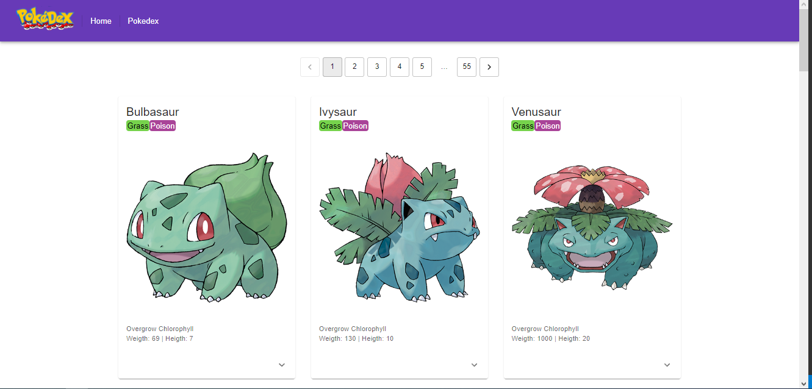

# Pokedex App



> A pokedex app created with base on data from PokeApiV2 with pagination and information about you favorite Pokemons

### Adjust and enchancement

This project is not done yet, still dev and want add some features like:

- [x] SearchBar

## 💻 Pré-requisites

Before you run, check if you attend to requisites below:
<!---Estes são apenas requisitos de exemplo. Adicionar, duplicar ou remover conforme necessário--->
* You have the latest version of `<nodejs / npm>`
* You have installed all dependencies with npm `<npm install>`
* You have a `<Windows / Linux / Mac>` machine.

## 🚀 Instaling <Pokedex>

To install <Pokedex>, follow this steps:

Windows:
Clone repository:
```
on aplication folder, open console and type:
<npm install>
```

## ☕ Using <Pokedex>

To use <Pokedex>, follow this steps:

```
on aplication folder, open console and type:
<npm run dev / npm run build && npm start>
```

[⬆ Back to top](#pokedex-app)<br>
